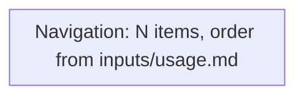

# <Lane label> lane map — <as built | target>, job level

One chart per lane, at the level of jobs and doors, not screens.
Screen-level charts live in each path file. The purpose of this map is to
see duplication and detours at a glance. There are two variants of this
template, described below; a lane gets one as-built map
(`<auditDir>/MAP-<lane>.md`) in step 1 and one target map
(`<auditDir>/target/MAP-<lane>.md`) in step 2.

Notation follows `UX-LAWS-PACK.md` §5. Solid edges are links a user can
click. Dotted edges are redirects, shims, or typed-URL-only doors.

## Legend

```
classDef dead fill:#7f1d1d,color:#fff
classDef silent fill:#78350f,color:#fff
classDef repeat fill:#1e3a8a,color:#fff
classDef job fill:#14532d,color:#fff
classDef shim stroke-dasharray: 5 5
```

- `dead` (as-built only): red, a dead end or a 404 on the seeded or test
  tree.
- `silent` (as-built only): amber, a silent-success or silent-failure state.
- `repeat` (as-built only): blue, asks for data the system already has.
- `job`: green, the first screen of a distinct job on this lane.
- `shim`: dashed border, a redirect-only route or a page kept for
  compatibility.

## As-built variant


Draw one node per screen or system action this lane's paths visit, one edge
per link or redirect between them, grouped by the path ID that owns each
subtree. Apply `dead`, `silent`, and `repeat` classes wherever a path file's
own chart used them; this map is the union of every path chart in the lane,
at job granularity.

## Target variant



There are no `dead`, `silent`, or `repeat` nodes on a target map by design;
each target path file proves that for its own screens (`TARGET-TEMPLATE.md`
§1's closing rule). Numbers in brackets on a node may cite production usage
from `inputs/usage.md` (lower bound) to justify nav order.

**Every door on the as-built map for this lane must either appear on the
target map, or be listed as removed in `target/DECISIONS.md` §4 with the
decision ID that removed it.** This is checked by hand when the target map is
drawn and is a definition-of-done item for step 2.

## Reading the map

A short prose section, three to six bullets, written after the chart:

- Which nodes carry the measured daily work, from `inputs/usage.md`, versus
  which lead to jobs with almost no logged use.
- Every place the same end state is reachable through more than one route
  (duplication findable at a glance from this map, not from any single path
  file).
- Where export, import, search, or another cross-cutting capability appears
  on more than one page, list every page it appears on.
- On a target map only: which change most reduced the door count, and which
  job's first screen now does the job (search, status change, check-in, or
  whatever this lane's most frequent action is) without a detour.
